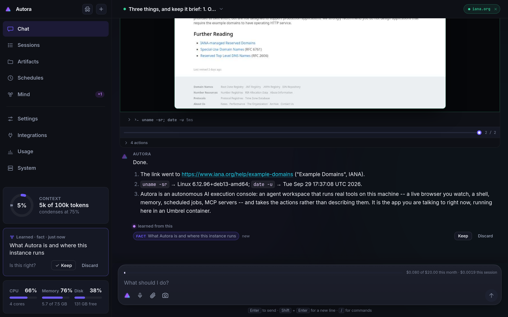
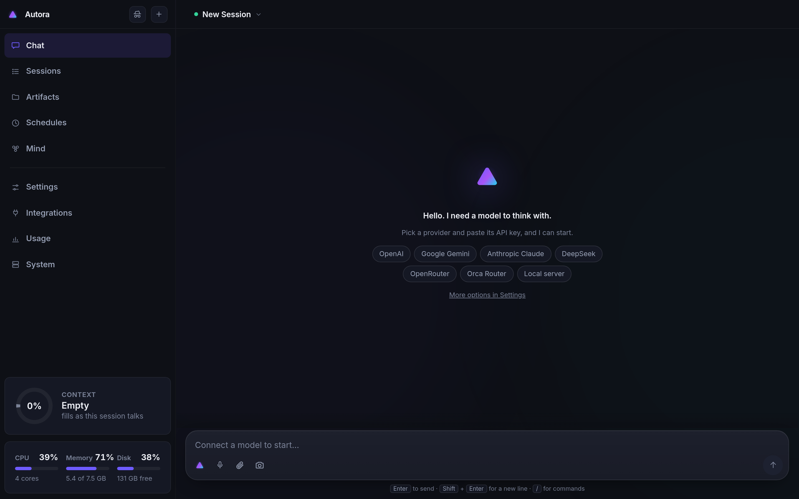
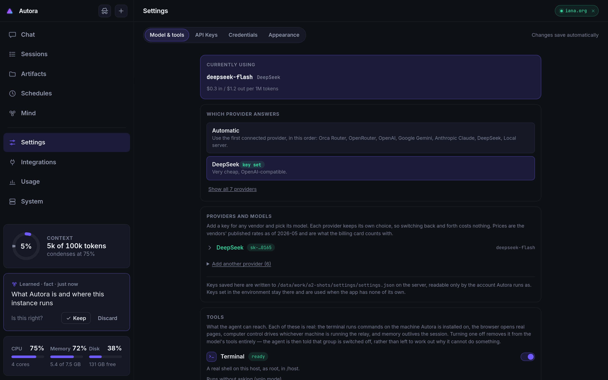
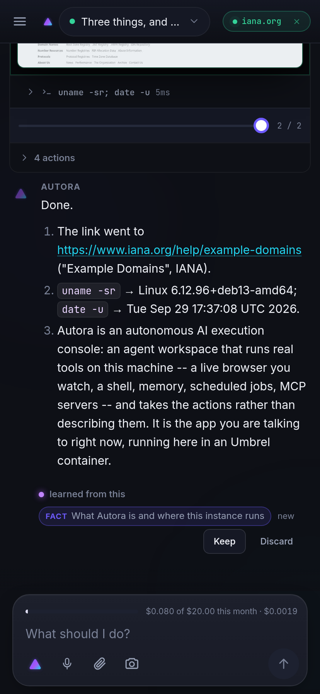
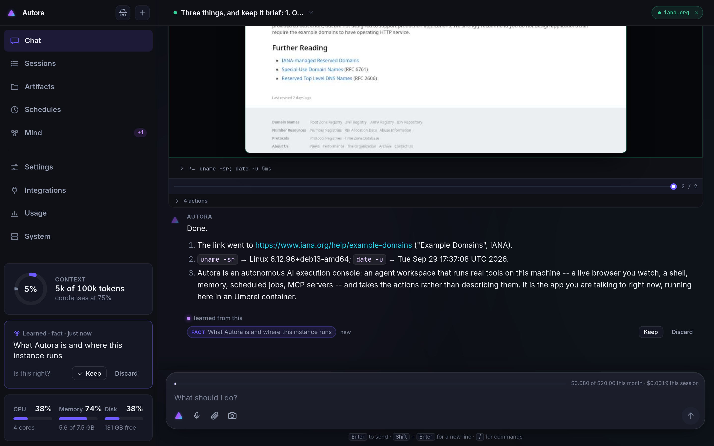

# Autora

<p align="center">
  <br>
  <b>An agentic harness you can watch.</b>
</p>

<p align="center">
  <a href="https://github.com/blofstedt/Autora/actions/workflows/check.yml"></a>
  <a href="https://github.com/blofstedt/Autora/actions/workflows/docker.yml"></a>
  
  
</p>

<p align="center">
  
</p>

The agent's browser, terminal, desktop and file edits stream into the
conversation in real time — each command, page and edit shown at the point it
happened, and still there to scroll back to afterwards. Every session records
itself, and reading one back is reading the thread. Approval in chat is off:
nothing waits for you, and every command is still shown as it runs.

Built on one idea: **the event log is the product.** Everything the agent does
emits a typed event to an append-only log. The live view is a subscriber to that
log. A recording is that log read back. There is no separate recording pipeline
to bolt on, and no way for the live view and the recording to disagree — they
are the same code path.

```
  agent ──emit──> event log (jsonl + blobs) ──┬──> websocket ──> live UI
                       │                      └──> replay ─────> same UI
                       └── asciinema export, grep, tail -f
```

## Before you run it

Autora is an agent with your machine's reach, and it is built to use it. This is
the part to read before installing it anywhere.

- **It has no login of its own.** Run from the command line it binds `127.0.0.1`
  and refuses everything else: whoever can reach the port is the operator.
  Installed on Umbrel it sits behind the dashboard's own login. Do not put it on
  the open internet, and do not forward a port to it.
- **Approval in chat is off.** There is no per-call gate: commands run when the agent decides to run them, and
  you watch them happen rather than being asked first. That is the whole point of
  the app, and it is also the risk.
- **The container is deliberately privileged.** The Umbrel compose mounts the host
  filesystem read-write at `/host` and sets `AUTORA_WORKDIR=/host`, because
  working on the server -- including deleting things -- is what it is for. The
  comments in `blofstedt-autora/docker-compose.yml` say so next to the mount.
  Run it on a machine you own, on a network you trust, in a VM if you can, and
  treat that machine as expendable.
- **Your provider keys stay on the server.** They are called from the server and
  never sent to the browser; a key saved in Settings is written to
  `.autora/settings.json`, readable only by the account Autora runs as.

## Quickstart

```bash
git clone https://github.com/blofstedt/Autora && cd Autora
npm install

export GEMINI_API_KEY=...        # optional -- keys can also be added in Settings
npm run dev
```

Open <http://localhost:3000>. Type a task. Watch it work.

<p align="center">
  
</p>

It listens on this machine only. Opening it to the network is a choice, and
[Before you run it](#before-you-run-it) has the terms: `AUTORA_HOST=0.0.0.0 npm
run dev` when you want it from a phone or another computer, on a network you
trust. Requests and live connections started by
other websites are refused either way.

For production, `npm run build` then `npm start`. The container is the same
two steps: `docker build -t autora . && docker run -p 8817:8817 -v autora-data:/data autora`.

#### On Windows

There is no Windows build and no installer: Autora is a Linux container, and
on Windows that means **Docker Desktop**, which runs it on WSL2. Install
Docker Desktop with the WSL2 backend, then the same commands, from PowerShell
or WSL:

```powershell
git clone https://github.com/blofstedt/Autora; cd Autora
docker build -t autora .
docker run -p 8817:8817 -v autora-data:/data autora
```

Then open <http://localhost:3000> for `npm run dev`, or <http://localhost:8817>
for the container. Four things are worth knowing before you start:

- **The container is deliberately privileged** — it watches the agent's
  terminal, browser and desktop, so it is not sandboxed and Docker Desktop's
  defaults will not confine it. [Before you run it](#before-you-run-it) has the
  terms, and they are the same on Windows as anywhere else.
- **Paths are the container's, not Windows'.** A tool call's `/host/data` is
  inside the Docker VM. `C:\Users\you\work` is mounted with
  `-v /c/Users/you/work:/host/work` (PowerShell: `-v C:\Users\you\work:/host/work`),
  and that mapping is what the agent sees.
- **`npm install` for development needs the WSL side**, not a Windows Node:
  the code runs on Linux, and a Windows install of `tsx`, `esbuild` and
  `node-pty` produces modules the container cannot load. Do development in
  WSL (`wsl` from PowerShell), where the repo behaves exactly as it does on
  Linux.
- **Line endings and file watching.** `git config core.autocrlf false` in the
  clone: shell scripts with CRLF fail with `bad interpreter`, and the file
  watcher makes WSL2 spin on `/mnt/c`. Keep the repo on the Linux side
  (`~/Autora`) rather than under `/mnt/c`, which is slow for exactly this
  kind of work.

The **desktop relay** runs on the machine with the screen, so on Windows that
is a Windows process talking out to the Autora container — see
[Controlling a desktop](#controlling-a-desktop). Nothing about it needs the
container to be on the same side of the WSL boundary.

### Connecting a model

Replies come from whichever provider you connect, called from the server -- the
key never reaches the browser. On a fresh install the chat opens on a card
that asks for one: pick a vendor, paste its key, and Autora checks it before
saving. For the model list and every other option, open **Settings** in the
sidebar:

| Provider | Get a key | Notes |
| --- | --- | --- |
| OpenAI | <https://platform.openai.com/api-keys> | GPT-5, GPT-4.1, GPT-4o, o3/o4-mini |
| Google Gemini | <https://aistudio.google.com/apikey> | Free tier covers Flash |
| Anthropic Claude | <https://console.anthropic.com/settings/keys> | Sonnet, Haiku, Opus |
| DeepSeek | <https://platform.deepseek.com/api_keys> | Cheapest of the hosted options |
| OpenRouter | <https://openrouter.ai/keys> | One key, hundreds of models; list and prices fetched live |
| Local server | — | Anything speaking the OpenAI API: vLLM, Ollama, llama.cpp |

<p align="center">
  
</p>

Each provider keeps its own key, model and endpoint, so switching between them
costs nothing. **Which provider answers** picks one, or leave it on *Automatic*
and the first connected provider is used, in the order shown in the panel.

Every model in the picker is quoted with its price per million tokens, and
those are the same numbers the [billing card](#billing) counts with. **Check
key** asks the vendor whether the key works before you rely on it, and fills
the model list from the same call; **Refresh models** re-asks later, which is
how the OpenRouter catalogue stays current.

Keys pasted into the panel are saved on the server in `.autora/settings.json`,
created readable only by the account Autora runs as. Keys set in the
environment (`GEMINI_API_KEY`, `OPENAI_API_KEY`, `ANTHROPIC_API_KEY`,
`DEEPSEEK_API_KEY`, `OPENROUTER_API_KEY`) are still honoured and are never
written to that file -- they are the fallback when the app has no key of its
own, and the panel says which of the two is in force.

Without any key the console still runs -- every panel, the event stream,
memory, approvals and the schedule all work -- but nothing answers, and the
thread says which key is missing rather than improvising a reply.

**[docs/GEMINI.md](docs/GEMINI.md)** covers the Gemini specifics: choosing a
model, the thinking budget, and what each error in the thread means.

### The voice it speaks in

Everything Autora says out loud -- the `v` key, replies read aloud, spoken
approvals -- uses one voice for the whole install. Left alone it is the
browser's own (`speechSynthesis`), which is a different voice on every
device and on most of them the worst one the platform has.

With a Deepgram key it speaks through Deepgram's hosted Aura voices instead:
nothing to run, one request a sentence, and the same voice on the phone, the
laptop and the desktop. Paste the key into **Settings -> Secrets** as
`DEEPGRAM_API_KEY` (or set it in the environment) and that is the whole setup.
**Settings -> Voice** lists the voices the service offers -- the list comes from
the service, so it is whatever it actually has -- plays a sample, remembers the
one picked on every device, and says which service is speaking.

There is one service and one key: Deepgram's hosted voices. A local voice
server is no longer looked for, and a key is the whole of the setup. Which
voice speaks can be changed in **Settings -> Voice**, and the choice is
remembered on every device. When the agent is asked to say something out loud
it uses its `speak` tool, which plays the words on the open page straight
away rather than making an audio file to hand over.

| Variable | Purpose |
|---|---|
| `DEEPGRAM_API_KEY` | Speak through Deepgram's hosted Aura voices. A key saved in Settings -> Secrets wins over this |
| `AUTORA_DEEPGRAM_VOICE` | The Deepgram voice to start with (default `aura-2-thalia-en`); a voice picked in Settings wins |

The page never talks to Deepgram itself. `POST /api/speech` takes a fragment
of text and returns an audio file, which keeps the key on the server and means
a phone on the tailnet needs no route of its own. `POST /api/speech/stream`
takes a whole reply and returns raw 24 kHz PCM as it is rendered, which is what
a narrated answer uses: Deepgram draws the voice fresh for every request -- the
same sentence sent twice comes back at a different pitch and pace -- so a
request per sentence was a voice that changed from sentence to sentence. The
first samples arrive in about half a second and run three or four times faster
than they are spoken, so one rendering for the turn still starts straight away. The audio arrives from the
origin the page already trusts. `GET /api/speech` says whether there is a key,
which voice it would use, and which voices the service has -- the list comes
from Deepgram's own model catalogue, so it is whatever it actually offers.

If there is none -- no key, wrong address, container down -- the panel says so
and the browser's own voice carries on being used. Nothing goes quiet, and
nothing is required to be set up.

### Talking to it

The mark at the left of the composer, or `v`, is talk mode: the strip you type
into becomes the conversation and the thread above it keeps running. It needs a
microphone, which browsers only open on a secure page -- `https`, or
`localhost`.

There is one thing to do, and it is to say the name. **Say "Autora"** and
whatever follows it -- "Autora, what's the weather" -- is the request; say the
name on its own and whatever you say next is. It goes out when you pause: a
sentence that has finished goes about a second later, one that trails off
mid-thought waits longer for you to come back to it. The bar says "Say 'Autora'
to add to the conversation…" while it is listening, and shows the words as they
form once it is yours.

The microphone is open the whole time talk mode is, and everything that is not
the name, at the start of a phrase, is dropped where it stands. That is what
makes talking over an answer work: say the name while Autora is speaking, or
while it is off working, and it stops and the words are yours. It is also how an
open microphone avoids hearing the answer and sending it back as a question --
nothing is listening for anything but its own name.

There is no switch for any of it, and nothing on the bar to press except the X
that takes you back to typing. The camera lives in Settings -> Voice; on, the
picture runs the width of the bar, and the agent is shown about a frame a second
of it.

The month's spend stays over the live bar in talk mode: a spoken turn costs what
a typed one does.

### Tools

A model decides; tools are what it decides *with*. **Settings -> Tools** lists
the five groups, says whether each can actually be used right now, and turns
each on or off:

| Group | What it is |
| --- | --- |
| Terminal | A real shell on the machine Autora runs on, via `bash -lc`. Output streams into the thread as it arrives. |
| Web browser | The Chromium the agent drives: open, read, click, fill, scroll, screenshot. |
| Computer control | Somebody's actual desktop, over [the relay](#controlling-a-desktop). |
| Memory | The workspace graph, which outlives the session. |
| Voice | Saying something out loud on the open page (`speak`), and going quiet when asked. |

None of them asks first by default. A chat whose header is switched from
**Yolo** to **Ask** holds every call that changes something -- or only the
ones matching what you wrote under "ask me when" -- for a yes on a card;
looking is never held.

The same list generates three things that used to be written down separately:
the tool schemas the model receives, the sentence the agent is told about what
it can do, and this panel. They cannot disagree, which is the point -- an agent
that has been told it has a terminal it does not have will narrate command
output rather than admit it, and one told nothing will deny having a shell it
is holding.

A group can be **off** (you turned it off, and the agent is told so) or
**unusable** (on, but the thing it needs is absent -- no Chromium on the
server, no relay dialled in). Those are different sentences, and the agent
gets the one that is true, because "I cannot browse" and "Chromium is not
installed on the server" send you to two very different places.

Nothing waits for approval: every call runs straight away and is shown in the
thread as it happens. Stop kills the whole process group, so `sleep 300` inside a
command dies with the command rather than outliving it.

The terminal is a shell, not a terminal emulator: there is no TTY, so `vim`,
`top` and anything that pages will hang rather than work. Use non-interactive
flags. `sudo` works wherever the account Autora runs as can use it -- in the
Umbrel container that is usually root, where it is unnecessary rather than
unavailable.

The **Tools** page in the sidebar switches the built-in windows: the widget
window (`widget_show`), the browser window (the same switch as Web browser
above), the construction window where websites and apps are built
(`app_preview`), and the PDF editor (the `pdf_*` tools). All are on by
default. One that is off is taken out of the model's tools from its next step
and the agent is told it is off; switching the construction window off also
closes any that are open.

`browser_screenshot` sees the window by default. With `full_page`, `ref`,
`selector` or `area` it takes the whole page, one numbered element, one
element by CSS selector or a rectangle, and with
`save_as` (and `notebook`) it keeps the picture as an artifact -- filed in a
notebook if asked -- so a screenshot can be evidence rather than a glance.

### Integrations (MCP servers)

**Integrations** in the sidebar connects Model Context Protocol servers; their
tools reach the agent as `mcp__<server>__<tool>` from its next step.

You rarely need to go there first. When a task lives on a service with an API --
GitHub, Slack, Notion, a Postgres database, Google Maps, library docs -- and no
connected server covers it, the agent offers one in the conversation instead of
reaching for the browser: a card saying what it is, why it beats clicking
through the website, and exactly what will run. Nothing is installed until you
tap **Set it up**, and **Not now** is remembered for the rest of the session.
Asking "what MCP servers could help with X?" gets an answer from the same list.

- **Keys** a server needs are typed on the card and saved straight to
  Settings › API Keys › Secrets. The server's config only refers to them as
  `${secret:NAME}`, filled in when it starts, so a key never enters the chat,
  the session log or the model's context.
- **Beyond the built-in list**, the agent can offer any MCP server published on
  npm (run with `npx -y`), a remote one at a URL, or **one it writes itself**:
  a few tools, each a short piece of JavaScript, generated into a real stdio
  server under the settings directory (`mcp-servers/`).
- **A launcher that downloads a binary for the platform** is given the build
  for *this* machine before it starts, fetched once into the data directory
  rather than a cache a container update wipes. webclaw's launcher has no musl
  entry, so on an Alpine container it used to fetch a glibc build it could not
  run and the only symptom was `MCP error -32000: Connection closed`.

Servers the agent set up are marked *set up by Autora* on the Integrations
page, where they can be edited, switched off or removed like any other.

The page also has a **Suggested for you** card, for the times you go looking
rather than being offered one in a conversation. It is deliberately quiet and
easy to satisfy: a server is suggested either because this install already
holds the key it wants — paste a GitHub token anywhere and the GitHub server
is a fact about the install rather than a guess — or because a word from its
list appears in your standing instructions or in the titles of your recent
chats. Nothing is installed by looking at the card, the line under each one
says which of the two it was, and no suggestions at all is a normal state of
affairs: a list padded to look helpful would be worse than an empty one.

### Billing

Settings carries a billing card: this month, today, and all time, with a
thirty-day chart and a breakdown by provider and model down to individual
turns. It is counted locally -- every turn records the tokens the vendor
reported and prices them from the table the model picker quoted -- so it is an
accurate running estimate, not an invoice. It cannot see usage from outside
this app, nor a vendor's own discounts, cache credits or minimums, and a turn
whose vendor reported no token count is marked as estimated rather than
silently averaged in.

An optional monthly budget draws a meter and warns as it fills. It does not
block: a console that stops answering mid-sentence because of a number typed
weeks ago is a worse surprise than the bill it was meant to prevent.

### Running fully local

```bash
# any OpenAI-compatible server: vLLM, Ollama, llama.cpp, LM Studio
AUTORA_LLM_BASE_URL=http://localhost:8000/v1 npm run dev
```

Then pick **Local server** in Settings and type the model's name
(`qwen3-coder`, say). The address can be set there too, which wins over the
variable.

### Reaching it from a phone

Autora speaks plain HTTP, which is fine over `localhost` and fine for
reading the thread from another device. Two things need more than that:

| Wants a secure page | Why |
| --- | --- |
| Install to the home screen | Browsers only install a PWA from an https origin |
| Dictation and live voice chat | Microphone capture is gated on a secure context |

<p align="center">
  
</p>

A private network is not enough — `http://box.tailnet.ts.net:8817` is an
insecure origin as far as the browser is concerned, and no amount of site
settings changes that.

**On a tailnet, this is one command and it is the best answer there is.**
Tailscale issues a real certificate, so there is no warning to click through,
and whatever was guarding the plain port — Umbrel's login, say — still guards
it. On the machine running Autora:

```bash
tailscale serve --bg --https=8443 8817   # https://<machine>.<tailnet>.ts.net:8443 -> :8817
tailscale serve status                   # confirm, and see the URL to open
tailscale serve --https=8443 off         # undo
```

**Not on 443.** Plain `tailscale serve --bg 8817` serves on 443, and on an
Umbrel that takes the port umbrelOS 2.0 needs for its own HTTPS dashboard:
umbreld then fails at boot with `EADDRINUSE ... :::443` and restarts in a loop,
and the whole box is unreachable. If that has happened, free the port with
`tailscale serve --https=443 off` and start Umbrel again
(`sudo systemctl start umbrel`).

Open the `https://` URL it prints, port and all, and the microphone,
the install prompt and everything else appear. It needs MagicDNS and HTTPS
Certificates enabled for the tailnet, both in the admin console under **DNS**;
`tailscale serve` will tell you if they are off. With a proxy in front you can
also drop `--host 0.0.0.0` and go back to the default `127.0.0.1` bind, so
nothing has to listen on the tailnet interface at all.

Anything else that terminates TLS works the same way: Caddy or nginx with a
certificate from `tailscale cert`, or whatever reverse proxy you already run.

**With nothing in front of it**, `AUTORA_TLS=1` is the fallback. Autora puts an
https listener on the next port up with a certificate it generates and keeps:

```bash
AUTORA_TLS=1 AUTORA_HOST=0.0.0.0 npm start   # http on 3000, https on 3001
```

Nothing moves — the plain port serves what it always did, and the http page
offers a link across.

That certificate is signed by a small authority Autora generates and keeps, and
the authority is offered for download at `/autora-ca.crt` (Settings → **Trust
this server** has it, with the steps for Android and iPhone). Install it on a
device and the warning stops, the microphone works, and the page installs to
the home screen as a real app — three complaints that are one fact underneath:
nothing on that device had vouched for the certificate. Leaves are issued per
hostname during the handshake, from the name the browser asks for, so reaching
the box by tailnet name, `.local` or bare IP all match.

Install it only on devices you own: an authority you trust can vouch for any
site to that device, and this one is worth exactly what the server holding its
key is. Skipping it costs nothing but the warning — clicking through still
opens the microphone, it just will not install to a home screen.

The listener itself has whatever authentication Autora has, which is none. That
is fine on a network you control and a poor thing to expose anywhere else,
which is why it is off by default in the Umbrel app (`AUTORA_TLS=1` to turn it
on) and why a real certificate in front is better still.

Until then the microphone and `Live` are still in the composer, greyed, and
tapping either says what is in the way and offers the secure page if one is
running — rather than vanishing and leaving you to conclude voice was never
built.

| Env | |
| --- | --- |
| `AUTORA_TLS=1` | Also serve https, with a generated certificate |
| `AUTORA_TLS_PORT` | Where (default: `AUTORA_PORT` + 1) |
| `AUTORA_TLS_CERT` / `AUTORA_TLS_KEY` | Use a real certificate instead |
| `AUTORA_TLS_NAMES` | Extra names or addresses for a browser that connects by bare IP (which names no host, so gets the certificate listing this machine's own addresses) |

The Umbrel app publishes 8818 for this and ships with `AUTORA_TLS: "0"`. Put a
proxy in front if you can; set it to `1` if you cannot.

#### Install it to the home screen

Once the page is on **https** — the tailnet URL above, or a certificate from
`/autora-ca.crt` — the browser will install it as an app, and it is worth
doing: it opens without the browser's chrome, it gets its own icon and
switcher entry, and the session list, the thread and the composer use the
whole screen.

| | |
| --- | --- |
| **Android** (Chrome, Edge) | Menu (⋮) → **Add to Home screen** → **Install**. Or the banner Autora shows when it sees an install prompt available. |
| **iPhone / iPad** (Safari) | Share → **Add to Home Screen**. iOS ignores the manifest's display mode, so installing is the only way to lose the browser bars. |
| **Desktop** (Chrome, Edge) | The install icon in the address bar, or menu → **Install Autora**. |

What it installs is `public/manifest.webmanifest` — standalone display,
portrait-friendly, icons at 192, 512 and a maskable 512 for Android's adaptive
shapes — plus the service worker in `public/sw.js`, which serves the app's
shell from cache so it opens instantly and does not show a browser error page
when the server is briefly away.

An installed copy is a copy: it keeps working while the server is down, which
also means it does not notice an update until it asks for one. Autora checks
`/api/system` and says so in a bar at the top when the version on screen is
behind the one being served — including a **Reload** button, and the service
worker calls `skipWaiting` so the reload actually lands on the new build
rather than the cached one.

### Controlling a desktop

Autora can drive a real computer's screen — click, type, scroll — through a
small relay that runs on that computer. The relay connects *out* to Autora, so
nothing has to be opened up on the machine with the screen, and it is a single
file with no Autora imports, so that machine does not need Autora installed.

Get it from the server you want it to reach, which fills the address in for
you:

```bash
# on the machine you want the agent to control
curl -O http://YOUR-SERVER:8817/relay.py      # Windows: curl.exe -O ...
pip install websockets mss pyautogui pillow   # Windows: py -m pip install ...
python relay.py                               # Windows: py relay.py
```

**Settings → Desktop relay** in the UI has those same three commands with your
server's own address already in them, says whether a relay is connected, and
lists what to check when one will not connect.

`python relay.py 192.168.1.5:8817` points it at a different address; any form
works — `host:port`, `http://host:port`, `ws://host`. Over https with Autora's
own certificate, the relay needs `--insecure` or the certificate from
`/autora-ca.crt` installed on that machine.

One thing catches people out: outside the container Autora listens on
`127.0.0.1` unless told otherwise, so start it with `AUTORA_HOST=0.0.0.0` if
the relay is on another machine.

Frames reach the conversation only while a session is using the desktop; a
connected but idle relay is not an hour of screenshots in your transcript. The
live preview in Settings tells you it is alive in the meantime.

macOS needs Accessibility permission for the terminal you run it from (System
Settings → Privacy & Security → Accessibility) — capture works without it,
clicking and typing do not. Linux needs an X display, so install XWayland under
Wayland. Windows needs nothing special.

### Other commands

```bash
curl localhost:3000/api/sessions                  # list recordings
curl localhost:3000/api/sessions/<id>/events      # one session's events, as JSON
```

Each session's full log is also on disk as `sessions/<id>/events.jsonl` under
the state directory, one event per line.

## What you see

One column: the conversation, with the work inside it.

<p align="center">
  
</p>

| In the thread | Shows |
|---|---|
| **A command** | The shell call where the agent ran it, its own output under it, colours and progress bars intact, with the exit code and how long it took. |
| **A page** | The page itself, live, while it is open: you watch the pointer travel and the clicks land. Once it has moved on, every frame of that stretch stays with the card, with a marker painted where each click went — drag its strip to move through them. The *agent* reads the page as text, not pixels — see below. |
| **A desktop** | The same, for the machine the relay is running on. |
| **An image** | Drawn in the conversation, at a size you can read and one tap from full screen — a screenshot it was asked for, a chart it made, or a picture it wrote into a sentence. |
| **An edit** | The unified diff, the moment it lands. |
| **Everything else** | One line each — a lookup, a read, a memory write — openable for the detail. |

Nothing is hidden behind a tab, and nothing scrolls away: the terminal from
three questions ago is still three questions up, next to the question that
caused it. Reviewing a session is scrolling back through it, which is also how
you review the session someone else ran — there is no separate recording mode
to enter, because the transcript *is* the recording.

The interface is dark, keyboard-friendly, and has no third-party dependencies at
runtime — fonts are vendored (Inter and JetBrains Mono, variable, Latin subset,
77KB total), so it works offline and on an airgapped box, and opening a session
does not tell a CDN about it.

It is one app at every size. On a phone it is a single column with the
conversation and a tab for scheduled tasks. On a desktop the session list comes
out into a rail on the left, the reading column widens, and screenshots and
diffs get room to be read at a useful size rather than shrunk into a pane.

| Key | |
|---|---|
| `/` | focus the composer |
| `k` | the knowledge web |
| `v` | live voice chat |
| `esc` | close whatever is open |

Every row in the session list carries a dot: green with a halo while that chat
is working, plain green when it only has a window open on it, and amber when it
is over -- nothing running and nothing holding it open.

The tab itself carries state: the favicon and title go violet while the agent
works, amber when it is waiting on your approval. An approval that lands while
the tab is in the background also chimes once.

## How the agent sees a page

Not by screenshot. `read` returns every interactive element on the page with
the role and name a screen reader would announce it by, numbered:

```
[0] textbox "Email address" value="ada@example.com"
[1] textbox "Password" password empty
[4] checkbox "Remember me" checked
[7] button "Sign in"
[9] link "Terms of service" -> /tos
```

Actions take those numbers: `click(ref=7)`, and `fill` takes a list, so a whole
form is one round trip instead of one per field. Every action returns a freshly
numbered page, so acting rarely needs a `read` first — and refs cannot go stale
without saying so, because a ref that quietly pointed somewhere else is how an
agent ends up clicking the wrong button.

The accessibility tree rather than the DOM, because the DOM is wrapper soup: a
button is six nested divs, and `innerText` cannot see a form field at all. The
a11y layer is what the platform already computes for perceiving an interface
without looking at it. That sign-in page above is ~110 tokens. A 1280×800
screenshot of it is ~1,300, and you cannot click it.

Screenshots remain, as the fallback they should be: for questions about how a
page *looks* — a chart, a canvas, a broken layout. The human still gets the full
video feed either way; the screencast is a separate channel from what the model
reads.

Name an address in a message and a real Chromium opens it. A bare domain needs
a verb in front of it — `open example.com`, not every passing mention of
`npm.io` — because launching a browser should be something you can point at
afterwards and say why it happened.

### Watching it work

Reading a page as text is what makes an agent good at browsing. Not being able
to see what it did is what makes it impossible to trust. So the two are
separate channels out of the same page, and you get both:

- **The model gets text.** The numbered outline above, and the page's readable
  prose. No pixels.
- **You get video.** Chrome's own screencast, frame by frame over the session
  socket, at six frames a second by default.

The pointer is real. Before a click, it travels to the target and a ring plays
where it lands — drawn into the page inside a shadow root so the page cannot
restyle it and it never appears in what the agent reads — and then the click is
dispatched as an ordinary mouse event at those coordinates. The agent is not
miming for the camera; it is clicking there, and the camera is pointed at it.

The feed is deliberately not part of the record. Frames go out over the socket
and are never written to the event log: a browsing session would otherwise be a
video file in the transcript, replayed in full to every tab that reconnects.
What the log keeps is keyframes — one after each navigation and each action —
which is what the card shows once the page has moved on. The card says
**watching** while frames are arriving and **back to live** once you have
scrolled back through them.

Nothing is encoded while nobody is looking: the stream stops when the last tab
closes and a fresh tab is handed one frame immediately, because a page sitting
still emits none of its own.

| | |
|---|---|
| `open <url>` | Go there. |
| `click(ref)` | Click the numbered element, visibly. |
| `fill([{ref, text}], submit)` | A whole form in one round trip. |
| `scroll(dy)` · `back()` · `read()` | The rest of it. |
| `shot()` | A picture of the page, into the conversation. |

The same calls are on `POST /api/sessions/:id/browser`, so a person can drive
the page too — which is what turns the card from a recording into something you
can take over.

### Pointing at things

Describing an element in prose and hoping the agent finds the same one is the
slow way to ask for a change; pointing at it is not. In the app window (below)
that is **Select**.

A pick resolves what you actually meant — point at the label inside a button and
you get the button — and comes back with a stable selector, and only the styles *that element* sets, not the whole inherited
cascade. Where the framework left a trail (React's dev fiber, a `data-source`
attribute) it resolves to the file and line that rendered it; where it did not,
it says so rather than guessing at a file. The pick lands in the thread like any
other event: the agent sees that you pointed and at what.

### The app window

When the agent builds a website or an app it starts it in the **app window**
(`app_preview`): a second browser per chat, beside the conversation on a wide
screen and a tab in the pinned view on a phone. A dev server it runs (its
address read from what it prints, https and base path included), a folder of
files it serves (reloaded by itself as the files change), or something already
running on this machine -- never another site. You see it take shape, at a
phone, tablet or desktop size, under its own back button, reload and address
bar (a path like `/about` goes to that page of the app).

Three tools on the page: **Use** (click, type, drag and scroll it as normal; a
dropdown's choices are listed over the page, since its own popup never reaches
the picture), **Select** (hover outlines, a click picks an element; the arrow
keys step outwards, inwards and sideways; shift adds more; the box can try a
change right on the page -- retype the text, set a colour, a size, a corner,
spacing -- and the change goes with the comment as before and after; a change
tried and then cancelled is put back) and **Region** (drag a box round
anything). Each comment is kept with a picture, pinned where it was made, and
they go together as one **review**: one message to the agent, with a picture of
each and, for every element, a unique selector, its words and styles, where it
sits, and the component and file when the framework says. Comments not yet sent
survive the agent restarting the window, and so does the size you picked.

The bar counts the page's console errors; tap the count to read them -- the
agent sees the same lines. If the dev server the window was started with exits,
the window says so, with the last thing it printed. The agent can `look` at the
page and its console to check its own work, and may do so while it is still
planning: looking changes nothing.

### PDFs

Attach a PDF (or name one on the server) and ask for what you want done to it.
Seven tools, always on, do what [SecurePDF](https://github.com/blofstedt/SecurePDF)
does in its editor, asked for in words instead:

| Tool | What it does |
| --- | --- |
| `pdf_read` | Pages and sizes, properties, form fields (with their choices and where each one is), attachments, and the text page by page. `find` searches instead, for words, a `/regex/` or the presets `email`, `phone`, `ssn`, `credit_card` and `date`, and says where each match is. `extract` saves embedded files, or an XFA form's XML. |
| `pdf_look` | Pages as pictures, for the agent and in the thread: a scan read, an edit checked. `grid` rules the page in points, which is how the agent finds where to put things; `area` zooms in. |
| `pdf_edit` | Fill form fields by name, flatten the form, and draw on pages: text, stamps (APPROVED, REJECTED, SIGN HERE, DATE, CONFIDENTIAL...), a signature (a picture, or a typed name in a handwriting font), images, ticks and crosses, boxes, circles, lines, arrows, highlights (a box, or wherever some words are) and comments. Also a watermark, page numbers, and the document's properties, set or stripped. |
| `pdf_compose` | Write a new PDF from a description of the document: headings, paragraphs, lists, tables, quotes, code and pictures, laid out onto pages with page numbers and a numbered list of the sources cited. The description is kept, so when new findings come in the agent updates, inserts or removes blocks by id and the whole document is laid out again, instead of repositioning anything. `pdf_edit` then marks it up on top. |
| `pdf_pages` | Keep, drop, reorder, repeat and turn pages, add blank ones, merge other PDFs in, or split into several files. |
| `pdf_redact` | Take words, patterns or boxes out for good. The pages concerned are redrawn as pictures with black boxes, so what was under them is gone from the file rather than covered; the rest keep their text. |
| `pdf_compress` | Rewrite it compactly, or redraw every page as a JPEG for a much smaller scan. Nothing is saved if it would not get smaller. |

Every result is a new file, shown in the thread to open or download; your own
file is never overwritten. A password-protected PDF opens with its password
(the agent asks for it), and what comes out is not protected -- the tools do
not add passwords. Positions are points from the top-left of the page as you
see it, whatever rotation or crop the file has underneath, so what `pdf_read`
reports, the `pdf_look` grid shows and `pdf_edit` takes are the same numbers.
Dropped and redacted pages are removed from the bytes, not just from view.

Dynamic XFA forms -- the ones most viewers only answer with "please wait" --
are read and drawn, and their filled-in data is listed, but they cannot be
filled here; `pdf_compress` with `mode: images` turns one into an ordinary PDF
of how it looks. The built-in fonts write Western European text; `pdf_edit`
refuses other scripts rather than writing question marks, and `pdf_compose`
writes the common ones another way (`->` for an arrow) and says which characters
it had to replace with `?`.

Pages are drawn, and text is read, by pdf.js in a headless Chromium -- the
same binary the browser tool uses. Without one, the tools still read a file's
properties and fields, fill it, draw on it, rearrange it and rewrite it
compactly, but cannot read its text, show its pages, find where words are,
type a signature, redact, or redraw pages as pictures.

### Notebooks

A notebook groups artifacts by purpose -- a case, a report, a project -- in
order, with notes between them. Each entry is either a file (with a caption
and a note on what it shows) or a note in Markdown that can cite the files it
rests on. Make them on the **Notebooks** page, or file a selection from
**Artifacts** with *Add to notebook*.

The agent has the same with the `notebook` tool (list, create, read, add,
edit, remove, move, export), and `notebook=` on `artifact_save` and
`browser_screenshot` files what it makes as it goes. Asked to compile
something -- a report from a set of emails, a rebuttal of a document with
proof -- it files every source with what it shows, writes each finding as a
note citing its evidence, and reads the notebook back to check nothing is
missing before it says it is done.

The notebook button beside the message box adds notebooks or saved files to
a message. The agent is given an index of each notebook (every entry, notes
to their first line) and reads the rest with `notebook read`. **Export**
downloads a notebook as one Markdown document, its files as numbered
exhibits. A file in a notebook is never cleared away by retention; deleting
it from Artifacts takes it out of every notebook, and deleting a notebook
leaves its files.

## Approvals

Autora runs without approval gates by default: a call runs straight away and
is shown in the thread as it happens, and Stop kills whatever is running. There
are two ways to put a gate back, and they are about different things.

**The chat's permissions** — in the header of the conversation, and saved
with it. *Yolo* is the default. *Ask* lets the agent look freely and holds
anything that writes, runs or sends for your yes -- all of it, or only what you
name: write when it should ask ("before deleting anything, before sending a
message") or tap a suggestion, and each call is read against your words. See
[`server/modes.ts`](server/modes.ts) for what counts as looking and what
counts as changing — the list is short and deliberate, and a tool that is not
on it is treated as a change.

**How the agent works** is a separate choice, in the message box: *Build*
does the work straight away, *Plan* is read-only -- it looks,
researches and writes its plan on the to-do list, and changes are refused --
and *Agent* (the default) plans first, then switches itself to build, and back if the plan
needs rethinking. Only a very simple task skips the plan. The switches show in
the thread; the selector stays on Agent.

**The per-group setting** — Settings → **Tools**, one approval mode for each of
terminal, browser, computer and memory. `never` (the default) asks nothing;
`risky` asks only about calls that change something; `always` asks about every
call in the group. Since 0.9.95 this setting is obeyed rather than only stored
— until then `needsApproval` in [`server/tools.ts`](server/tools.ts) returned
false whatever it said — so an install that set `always` and saw nothing happen
will now be asked.

Both of those are about the ordinary work of a turn, and neither touches what
comes next. Whatever the mode or the setting says, the guard's standing
agreements decide the calls it was taught, and the irrecoverable tier — a
format, a recursive delete of everything, a force-push over main — stops and
asks every single time. A mode cannot be granted by the agent: it is set by you,
on the chat, and the agent is told what it is.

## Context

The model's context is a projection of the event log, the same way the UI is —
`compose(events)` in `src/autora/context.py` folds the log into messages, so
there is no second history to drift out of sync, and "what was in context at
step 12" has an answer.

That projection is where the cost lives. Two things it does:

**Caches the conversation prefix.** The system prompt and tools were already
cached; the history was not, so a forty-step turn re-sent an ever-growing
conversation as fresh input on every step. A breakpoint on the tail means each
turn is paid for once instead of once per remaining iteration.

**Trims old tool output.** A 4000-line test run matters while the agent is
acting on it and not ten steps later, so old results are demoted to a preview
plus a pointer. The full text stays in the blob store — `recall(ref=…)` reads it
back, and `recall(ref=…, search="…")` greps it. Lossy in context, lossless on
disk.

Compaction is batched and sticky rather than continuous, because rewriting
history invalidates the cached prefix from the rewrite point on. Nothing is
trimmed until the window crosses `trigger_tokens`; between compactions the
context is strictly append-only.

On a 30-step turn with 3KB of output per step, measured with
`estimate_tokens`:

| | final request | turn total |
|---|---:|---:|
| Before | 18,633 | 288,880 |
| After | 6,052 | 136,460 |

Applying Anthropic's published cache multipliers to those counts puts the turn
at roughly `0.8×` the cost of a single uncached send of its final request, down
from `15.5×` — most of it from the breakpoint, not the trimming. Real billing
depends on actual cache hits; check `usage.cached` in the UI. Tuning lives in
`ContextPolicy`.

## Memory

The agent keeps what it learns in `~/.autora/memory.db` — one SQLite file, no
service, openable with any SQLite client. Four kinds of record: **preferences**
(how you want things done), **procedures** (a how-to that worked — a skill, once
you stop capitalising it), **facts**, and **episodes** (a notable outcome worth
recalling).

Two rules keep it from rotting:

**Everything has provenance.** A record points back at the session and event
that produced it. A memory system without that becomes a junk drawer — claims
accumulate and a wrong one is indistinguishable from a right one. Being able to
ask "why do you think that?" and delete the answer is what makes the rest
trustworthy.

**Nothing is confirmed on first sight.** Records written automatically land
`provisional`, and are promoted only when a later session independently writes
the same thing. Nothing is learned at all from a run that failed or was
interrupted — a procedure learned from a broken run teaches the break.

Retrieval is budgeted rather than dumped. A handful of pinned records are always
present; the rest is searched per prompt (SQLite FTS5, BM25-ranked) and capped
hard. Everything else stays one `memory(action="search")` away. In practice a
store of 42 records puts about 130 tokens in front of the model. The block is
emitted as an event, so it is in the thread and in the recording: you can see
exactly what the agent was primed with before it answered.

Lexical search rather than embeddings is a deliberate choice, not a shortcut —
for one person's memory the recall problem is small, and a BM25 hit you can
explain beats a cosine distance you cannot. Embeddings are a later optimisation
if recall proves insufficient.

### The knowledge web

Press `k`. Everything the agent knows, as a graph: colour by kind, size by how
often it has been recalled, a ring for pinned, faded for provisional. Click a
node for its content, its tags, and the session it came from. Pin it to load it
every time, retire it, or delete it for good.

The point is not the picture. Memory you cannot see is memory you cannot
correct — an agent that has quietly decided something wrong about you will keep
acting on it forever unless there is somewhere to go and say no.

## Work that starts by itself

Three things in Autora run without you asking, and they are deliberately
different shapes:

| Starts because | Where | What it is |
| --- | --- | --- |
| A time came | Settings → **Scheduled tasks** | A cron expression and a prompt. With a **watch** attached, the cron is how often to look at a page, a file or a command's output, and the prompt runs only when what it saw changed. |
| Something outside said so | Settings → **Scheduled tasks** → **Triggers** | A URL, a secret and a prompt. Anything that can make an HTTP request starts it. |
| The console finished something | Settings → Configuration → **Proactivity** | A background job that outlives its turn is read and reported by a turn the console starts itself. |

A **trigger** exists because not everything that matters is on a clock or a
page. A CI run knows when it has finished; a script on another box knows when
its data landed. Give it somewhere to shout and it becomes a turn here, in a
session of its own, exactly like a scheduled run — same notifications, same
session list, same budget:

```bash
# shown once when the trigger is made, then never again
curl -s -X POST https://box.example.ts.net:8443/api/triggers/trig-abc123/fire \
  -H "x-autora-token: <the secret>"
```

The token can go in `x-autora-token`, in `Authorization: Bearer`, or as
`?token=`, and the body is passed to the turn as *data* — it came from the
network, so it is somebody else's words, and the turn is told so. A trigger
with no secret cannot be armed, the secret is compared in constant time and
can be rotated without losing the trigger's history, and a trigger is only
ever listed with its fingerprint, never its secret.

**Proactivity** is the one thing here that speaks without being spoken to. Off
by default: with the wake switch on, a background job that finishes is read by
a turn the console starts in the chat that began it — at most three times an
hour, never inside your quiet hours, and only while the day's automation
budget lasts. It is a turn, so it costs what a turn costs. With it off,
nothing is lost: the job's result still arrives with the next thing you say.

A chat's **permissions** (Yolo or Ask) decide what waits for you, and its
**mode** (Build, Plan or Agent) decides how the agent goes about the work; both
are per conversation and saved with it. Neither weakens anything below: the
guard's standing agreements and the irrecoverable tier ask whatever they say.

## Configuration

| Variable | Purpose |
|---|---|
| `GEMINI_API_KEY` | Google Gemini key — or add one in Settings instead |
| `OPENAI_API_KEY` | OpenAI key |
| `ANTHROPIC_API_KEY` | Anthropic Claude key |
| `DEEPSEEK_API_KEY` | DeepSeek key |
| `OPENROUTER_API_KEY` | OpenRouter key |
| `GEMINI_MODEL` | Starting model for Gemini (default `gemini-flash-latest`, the rolling free-Flash alias); a model chosen in Settings wins |
| `GEMINI_THINKING_BUDGET` | Thinking tokens (default `0` for a responsive console; `-1` lets the model decide) |
| `AUTORA_STATE_DIR` | Where settings, keys and the spend ledger are written (default: `$AUTORA_HOME/settings`, else `.autora/` beside the app) |
| `AUTORA_PORT` / `AUTORA_HOST` | Where to listen (default `3000` on `127.0.0.1`, this machine only; set `AUTORA_HOST=0.0.0.0` to reach it from other devices. The container uses `8817` on `0.0.0.0`) |
| `AUTORA_WORKDIR` | Where the agent's commands run when Settings names no directory (the Umbrel app sets `/host`, the host's filesystem) |
| `AUTORA_TLS` | `1` also serves https on the next port up, with a certificate Autora issues from its own authority (download it at `/autora-ca.crt`) |
| `AUTORA_TLS_PORT` | Where the https listener goes (default: `AUTORA_PORT` + 1) |
| `AUTORA_TLS_CERT` / `AUTORA_TLS_KEY` | A real certificate and key (PEM files) to use instead of Autora's own |
| `AUTORA_TLS_NAMES` | Extra names or addresses, comma separated, for the certificate shown to a browser that connects by bare IP |
| `AUTORA_LLM_BASE_URL` | Local OpenAI-compatible endpoint |
| `AUTORA_BROWSER_PATH` | The Chromium to drive (default: the usual system paths; `/usr/bin/chromium-browser` in the container) |
| `AUTORA_CONTEXT_TOKENS` | The context window the prompt is kept inside (default `100000`; set it to your model's window for small local models) |
| `AUTORA_COMPACT_AT` | Fraction of that window at which older turns are folded into working memory in the background (default `0.75`) |
| `AUTORA_PROTECTED_TURNS` | Most recent messages that are never summarised (default `6`) |
| `AUTORA_MAX_TOOL_TOKENS` | Tool output longer than this is kept in the session vault, with its start and end left in the prompt (default `3000`) |
| `AUTORA_COMPACTION_MODEL` | A cheaper model of the same provider to write the working memory with (default: the chat model) |
| `AUTORA_MAX_OUTPUT_TOKENS` | Output tokens the model may write per step of a task (default: 8192) |
| `DEEPGRAM_API_KEY` | Speak through Deepgram's hosted Aura voices; a key saved in Settings -> Secrets wins |
| `AUTORA_DEEPGRAM_VOICE` | The Deepgram voice to start with (default `aura-2-thalia-en`); a voice picked in Settings wins |
| `AUTORA_BROWSER_HEADED` | `1` shows a real browser window instead of running headless |
| `AUTORA_BROWSER_FPS` / `AUTORA_BROWSER_QUALITY` / `AUTORA_BROWSER_STREAM_WIDTH` | How much live video to send (default `10` fps, at most `30`; quality `50`; scaled to `960` wide) |
| `AUTORA_BROWSER_TZ` / `AUTORA_BROWSER_LOCALE` | The time zone and language the browser reports to sites (default: looked up from this machine's public address, kept a week) |
| `AUTORA_SHELL` | The shell commands run in when Settings names none (then `$SHELL`, then bash, ash, sh) |
| `AUTORA_DEEPGRAM_STT_MODEL` / `AUTORA_DEEPGRAM_STT_LANG` | What talk mode listens with through Deepgram (default `nova-2`, `en-US`) |
| `AUTORA_DEEPGRAM_STT_URL` | A Deepgram-compatible listening server to use instead of Deepgram's (the key is sent there) |
| `AUTORA_MCP_BIN_DIR` | Where downloaded MCP server binaries go (default `$AUTORA_HOME/bin`) |
| `AUTORA_PUSH_SUBJECT` | The contact sent to push services with phone notifications (default `mailto:autora@localhost.invalid`) |
| `AUTORA_HOME` | State directory (default `~/.autora`; `/data` in the container) — the one place that survives an update |

## Where sessions live

```
~/.autora/sessions/<id>/
  events.jsonl     # the whole session, greppable, tailable
  blobs/           # content-addressed frames (deduped)
  meta.json
```

`tail -f ~/.autora/sessions/<id>/events.jsonl` is a supported debugging path, not
an accident.

## Releasing to the Umbrel store

Umbrel decides whether an update exists by comparing one string: `version` in
`blofstedt-autora/umbrel-app.yml`. Not the image digest, not the commit. A
change can be merged, built and pushed to the registry, and every installed
copy will still report itself up to date — removing and re-adding the community
store re-fetches the same manifest and reaches the same conclusion.

So a change that reaches the container raises `version` in `package.json`
(and `package-lock.json`) and rewrites `releaseNotes`, which Umbrel shows on
the update. It leaves the manifest's `version` and the image tag in
`docker-compose.yml` alone: once main's image for the new version is in the
registry, the image workflow commits both to main itself
(`.github/scripts/offer_release.py`). Umbrel therefore never offers a version
whose image is still building. When pull requests raised the manifest
version themselves, an update taken in the minutes before the image finished
failed with "manifest unknown"; with `:latest`, it installed the previous
build under the new version number. CI enforces this on every pull request;
a change with no user-facing effect opts out with `[no release]` in the pull
request title or body.

```bash
python3 .github/scripts/check_release.py --base origin/main   # the same check, locally
```

## How this was built

Every line of this repository was written by an agent. The direction, the
decisions and the rejections were the author's; the typing was Claude Code's,
session after session. The history says so rather than hiding it -- most commits
are authored by Claude and carry a `Claude-Session:` trailer pointing at the
session they came from, and `CLAUDE.md` is in the tree.

That is not a disclaimer. A harness for watching agents work is best evidenced by
having been built with one: the recordings of the sessions behind this code are
the same recordings the app makes for anybody else, which is why fixing a bug here
often means reading back the session that introduced it.

## Status

Working and tested: the event store and its backpressure, the agent loop and
its tools (terminal, browser, desktop relay, memory, schedules, MCP servers),
the web UI, replay, spoken replies and dictation through Deepgram, context
composition and compaction, accessibility-tree page reading, element picking,
the app window and its review, memory with provenance, the knowledge web.

```bash
npm test       # every tests/*.test.ts; the ones that need Chromium skip without it
npm run lint   # typecheck (client, server, tests), then ESLint
```

See [docs/ARCHITECTURE.md](docs/ARCHITECTURE.md) for why it is built this way.
