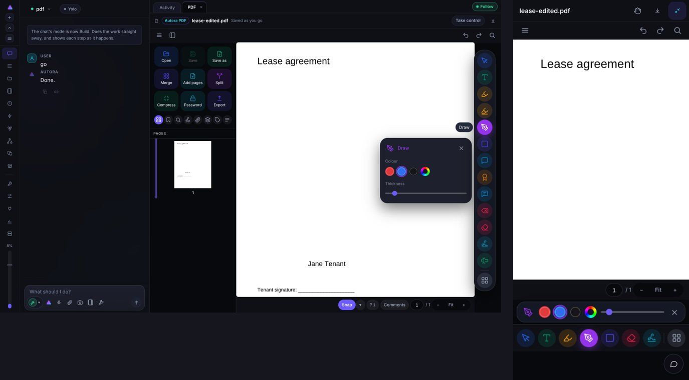
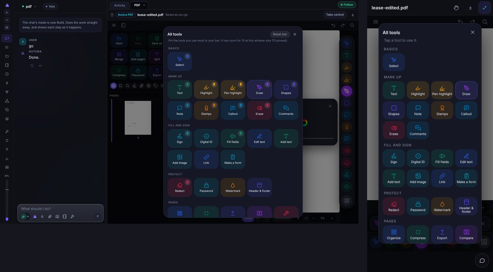
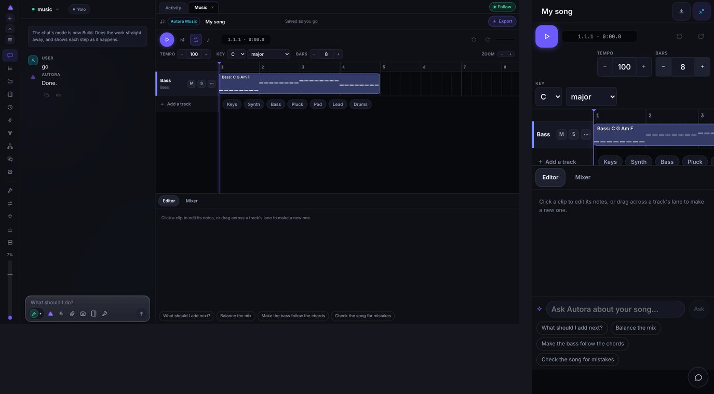
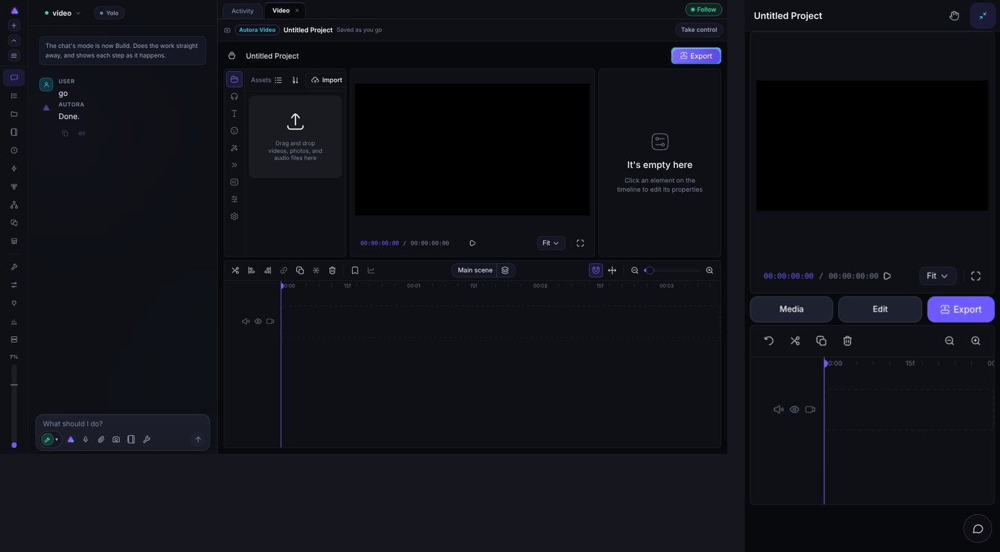
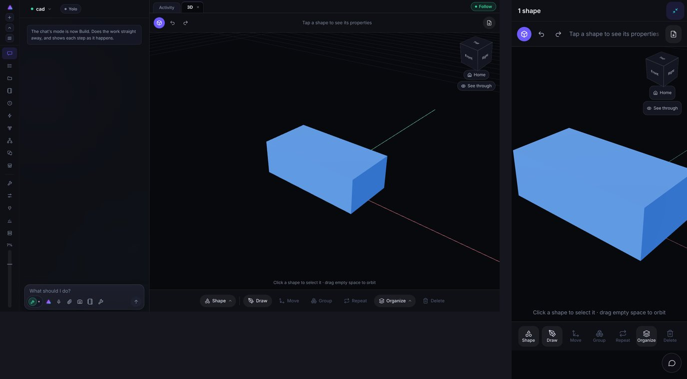
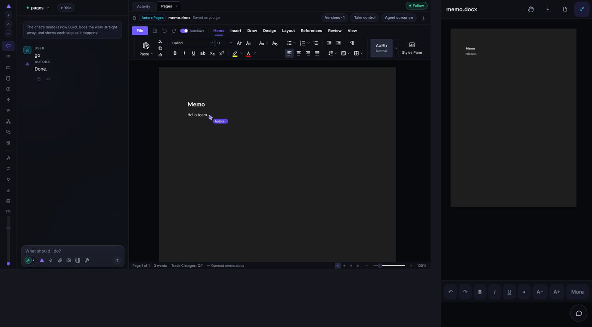
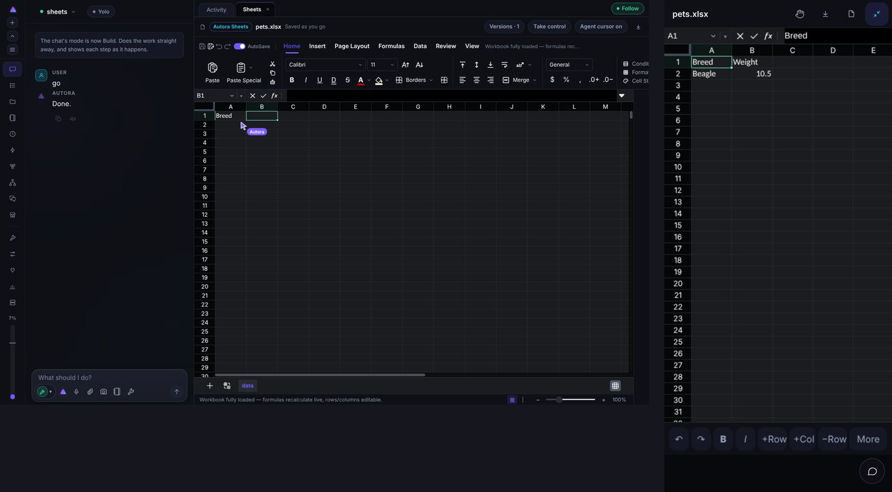
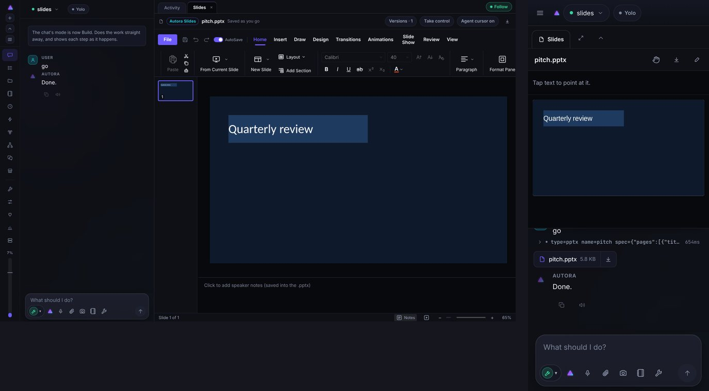
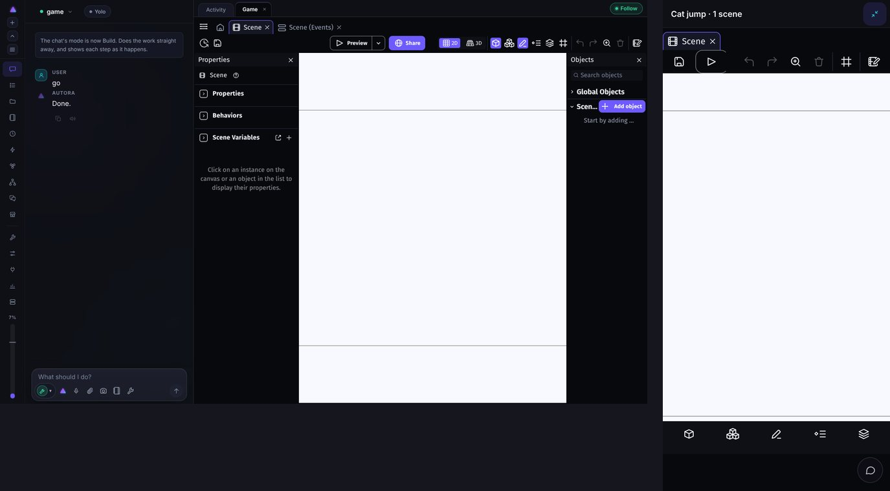

# Tool rail audit: the PDF window against every other Autora app

Written 2026-10-10 against 0.9.195. This compares the PDF window (the reference, built to
`docs/TOOL-RAIL.md`) with Pages, Sheets, Slides, Video, Music, 3D and Games, on a desktop
(1440x900) and a phone (390x844, full screen). Games come last because they are the hard one.

Every screenshot is a real build of the app, driven by the test harness's fake model, in the
dark theme. Left of each picture is the desktop, right is the phone.

**Not captured, and why.** Photo: its editor is Rust compiled to wasm and `trunk` is not
installed here, so Photo is described from its source only. Terminal, Browser and the App
(Creator) preview are described from source too: none of them is a tool-palette app, so they
need a different treatment (see "Second wave"). The video preview is black because the
project has no media.

## 1. What the PDF window does that the others don't

| | PDF (reference) |
|---|---|
| Tools | One floating pill of round, coloured buttons: right edge, centred, on a desktop; a dock along the bottom on a phone |
| What shows | As many as fit (measured), never scrolls; desktop 13 at 900px tall, phone 7 |
| Everything else | Last button opens **All tools**: a centred modal, grouped (Basics, Mark up, Fill and sign, Protect, Pages), tiles in the tool's colour |
| Pinning | Desktop only: a pin on each tile, "Reset bar". Phone: no pins, defaults only |
| Options | A tray for the open tool only: a one-row strip above the dock on a phone, a card beside the rail on a desktop |
| Top bar | Slim: menu, panes toggle, undo/redo, find |
| Colour | By verb (Select blue, Text emerald, Draw purple, Redact rose, Sign cyan), surfaces stay Autora's |





## 2. How each other app compares

| App | Desktop today | Phone today | Distance from the PDF pattern |
|---|---|---|---|
| **PDF** | Rail + tray + grid + left panel | Dock + tray + grid | The reference |
| **Music** | Two toolbar rows (transport; tempo, key, bars, zoom), lanes, Editor/Mixer tabs, a prompt row with chips | The same rows stacked | Large: no tool bar at all |
| **Video** | Whole OpenCut editor: icon strip on the left, properties on the right, 12-icon timeline toolbar | Preview, then Media / Edit / Export buttons, then a 6-icon timeline toolbar | Medium: phone is already a paired-down layout, but not the rail |
| **3D** | Text-labelled pills along the bottom (Shape, Draw, Move, Group, Repeat, Organize, Delete) | The same seven pills, bottom | Small: right idea, wrong shape, no grid, no colour |
| **Pages** | Full Word-style ribbon (File, Home, Insert, Draw, Design, Layout, References, Review, View), two rows tall | Starts as a picture of the page (view only); the pencil opens a full-screen editor with a row of 8 grey text buttons and "More" | Large on desktop, medium on phone |
| **Sheets** | Same ribbon, plus formula bar | Grid with a row of grey buttons (undo, redo, B, I, +Row, +Col, -Row, More) | Same as Pages |
| **Slides** | Same ribbon, slide strip, notes | Picture of the slide, pencil to edit | Same as Pages |
| **Photo** | The editor's own panels (not captured) | One bar: Undo, Redo, Tools, Brush, Layers, Fit, with a sheet over it (`photo/overlay/autora.rs`) | Medium: phone bar is close to a dock |
| **Games** | The whole GDevelop IDE: two panels, two toolbars, tabs | Tab row, 8-icon toolbar, unlabelled 5-icon bottom bar | Large; see section 5 |



On a phone, Music spends the first 40% of the screen on tempo, bars and key before the
timeline appears, and the prompt row with four chips takes another 300px that the chat button
already covers. The instrument chips (Keys, Synth, Bass, Pluck, Pad, Lead, Drums) are a
natural tool grid, hidden in a row you scroll sideways.





`docs/TOOL-RAIL.md` says "Browser and 3D already fit". Only partly: 3D already has a bottom
bar with sub-menus, but on a desktop it is at the bottom and not the right, the buttons are
text pills, there is no colour per tool, and no All tools.







On a phone the Office apps already have a bottom row. It is grey, text-labelled, differs per
app (Docs has B/I/U/A-/A+, Sheets has +Row/+Col), and "More" opens the real ribbon over the page.

### Inconsistencies in the parts every app already shares

- **The top strip.** PDF, Pages, Sheets, Slides, Video, Music and Terminal show the "Autora X"
  badge, file name and "Saved as you go" on a desktop. **3D, Photo and Games show nothing**:
  `CadWindow`, `PhotoWindow` and `GameWindow` render the bar only `phone &&`.
- **"Take control"** is on PDF, Office and Video, and missing on Music, 3D and Games.
- **Undo/redo** sits in a different place in every app: PDF's top bar, Music's transport row,
  3D's top-left, Games' toolbar, Video's timeline toolbar.
- **Phone default view.** A window opens pinned at 46% of the screen height. PDF's rail is only
  usable in full screen, and PDF already treats the pinned view as look-only. Every app should
  follow the same rule, so the pinned view never needs a bar.

## 3. Proposal

### 3a. Build the rail once

The PDF rail is about 670 lines inside the Spectra iframe (`spectra-editor/src/autora/rail.tsx`).
Copying it into five more sub-projects (GenOffice, OpenCut, PhotoCraft, GDevelop, autora-3d,
each with its own build) would drift in a month. Recommendation:

1. Extract the rail (bar with measured fit, grid modal, pins, tray shell, colour tokens) into
   one component, `src/components/ToolRail.tsx`, in the host app around the window.
2. Each app supplies a manifest and a runner, nothing else:
   ```ts
   type RailTool = {
     id: string; label: string; group: string; icon: IconName; colour: Verb;
     phone?: true;        // in the phone's default bar
     desktop?: true;      // in the desktop's default pins
     tray?: TrayKind;     // "colour+size" | "colour+slider" | "text" | "none" | custom
     run(): void;         // calls the app's own command
   };
   ```
3. PDF's `rail-tools.ts` already has this shape: move its type out and make PDF the first
   consumer, so the PDF window cannot regress.

The host can drive Music, Video, Photo, Office and Games from outside their frames because the
agent already does (`opencut.ts`, `studio.ts`, `photodesk.ts`, `officedesk.ts`, `gamedesk.ts`
send commands to each editor). I have not checked that every command the person would need
exists in each channel. That is the first thing to verify per app, and where a command is
missing it is added once, which also gives the agent the capability.

### 3b. One rule for colour: by verb, not by app

Use the same colour for the same action wherever it appears, so a person learns it once.
Select blue, Text emerald, Highlight/Stamp amber, Draw purple, Shapes indigo, Comment sky,
Erase/Delete/Redact rose, Sign/Insert cyan. New verbs (Split, Mixer, Orbit...) pick from the
same family.

### 3c. Defaults per app

The grid always holds everything the app has today. Nothing leaves; it moves. "Phone" is the
bar (7 or fewer); "Desktop" is what is pinned at first (the person changes it).

| App | Phone bar | Desktop adds | In the grid only |
|---|---|---|---|
| **Music** | Select, Draw notes, Erase, Split, Add track, Mixer, Song (tempo, key, bars in its tray) | Duplicate, Loop, Metronome, Zoom, Instruments | Export, Quantize, Humanize, the Editor panel |
| **Video** | Select, Split, Text, Media, Audio, Effects, Captions | Stickers, Transitions, Filters, Snap, Ripple | Project settings, Export options |
| **3D** | Shape, Draw, Move, Group, Repeat, Organize, Delete (same tools, round and coloured) | See through, Home view | Shape types and Organize's sub-menu |
| **Pages** | Select, Text, Style, List, Highlight, Insert, Comment | Table, Image, Link, Layout, Track changes | References, Review, Design, Export |
| **Sheets** | Select, Text, Number, Fill, Borders, Chart, Formula | Sort, Filter, Merge, +Row, +Col, Freeze | Data, Page layout, Review |
| **Slides** | Select, Text, Shapes, Image, Layout, Theme, Present | Transitions, Animations, Notes | Slide show, Review |
| **Photo** | Select, Brush, Erase, Crop, Adjust, Layers, Fit | Filters, Text, Shapes, Clone | the editor's full command list |

The Office ribbon is the biggest job: its menu tree (`File` and the tabs) goes behind the
top-left menu button, as Spectra's menu tree does, and the ribbon's groups become grid sections.
The phone's grey "More" button goes away; the grid button replaces it.

### 3d. The top strip

Make it the same everywhere, desktop and phone: badge, name, "Saved as you go", Take control,
download, and (phone) full screen. Add it to 3D, Photo and Games on a desktop. Undo/redo moves to
the slim top bar in every app, as PDF has it.

### 3e. The agent always has everything

The rail is a view; the agent never reads it. Three changes keep it that way:

1. **One manifest, two readers.** The manifest in 3a also generates the "what the person sees"
   paragraph of each window's manual in `server/handbook.ts`, so the manual cannot say a tool is
   on the bar when it is not. Today the PDF manual is hand-written.
2. **A test that fails when a tool is UI-only.** For each manifest entry, `tests/` asserts that an
   agent tool or editor command reaches the same action, or the entry says `uiOnly: true` with
   a reason (for example "opens a dialog"). This is the guard for "all tools behind the scenes".
3. **The agent points, it does not guess.** Add one tool, `window_show_tool { app, tool }`, that
   opens the tray (or the grid with the tile highlighted). A person who asks "where is the
   split tool?" is shown, and a tool not on the phone bar is one tap from the grid. This does not
   exist yet; the manual currently asks the agent to say "open All tools" in words.

Pins stay out of the agent's view on purpose: it works the same whichever tools a person pinned
and whichever device they are on. Desktop pins are in `localStorage` per app; saving them to
the server (as appearance is) would carry them across devices. That is optional.

### 3f. Order

| Step | Why this order | Size (my estimate) |
|---|---|---|
| 1. Extract `ToolRail` from PDF, with PDF as its first user | Proves the shared shape without changing what people see | M |
| 2. **Music** | Host-native React, so no iframe bridge; worst phone offender; the one with an empty slot where tools should be | M |
| 3. **3D** | Smallest gap: restyle seven buttons and add the grid | S |
| 4. **Video** | Phone layout already exists; gain is a consistent bar and the grid | M |
| 5. **Pages, Sheets, Slides** | Biggest surface (the ribbon), but one shell (GenOffice) so the work is shared | L |
| 6. **Photo** | Needs the Rust editor built to test; the phone bar is already close | M |
| 7. **Games** | See below | L |

`docs/TOOL-RAIL.md` lists Pages, Sheets and Slides straight after PDF. I would put Music and 3D
first because they are cheaper and prove the shared component before the ribbon work starts.
That is a change to the stated order, so it needs your agreement.

Each step also changes that app's manual in `server/handbook.ts` and its test in
`tests/handbook.test.ts` in the same commit (CLAUDE.md), plus a release bump.

## 4. Second wave (not captured)

- **Terminal** already has a bottom row of keys a phone lacks (`tm-keys`). It has no tools, so
  it only needs the shared top strip.
- **Browser** has its own toolbar (back, reload, address, hand-over); it is a navigation bar,
  not a palette. Leave it, and put the shared top strip on it.
- **App (Creator) preview** has an inspector and versions. Treat it like Games: the person is
  designing, so tools like Pick, Inspect and Review are the candidates.

## 5. Games, last



GDevelop is an IDE for programmers: tabs for scenes and event sheets, a properties panel, an
objects panel, two toolbars. It is the opposite of the PDF window, where every tool is an action
on a document. Three things make it hard:

1. **Most of its surface is coding.** CLAUDE.md says games are creative: coding stays in the
   background, the person asks for actions and properties ("slippery", "jump", "run"), and every
   granular setting stays theirs. A rail that exposes Events would put the code back in front of them.
2. **The pin never moves.** Changes go in `gdevelop-editor/overlay/` and `patches.mjs`, so each
   rail change is a patch against GDevelop's UI, not a new component.
3. **A game has modes.** Editing a scene, placing objects, and playing it are different states
   with different tools, where a PDF is always being marked up.

Suggestion, to settle before building: the rail holds *world* tools (Place object, Move, Draw
terrain, Camera, Layers, Play), the tray holds the selected object's properties as sliders and
switches with plain names, and the phone's five unlabelled icons become the same labelled
round tools. Events, behaviours and variables sit in the grid under a "Behind the scenes" group,
reachable but not on the bar, and the agent writes them. I would spike this on the phone first
(it already has a bottom bar) before touching the desktop.

## 6. Questions for you

1. Do you want the shared `ToolRail` host-side (my recommendation) or one rail per sub-project?
2. Should 3D and Music go before Pages/Sheets/Slides, against the order in `docs/TOOL-RAIL.md`?
3. Is "Behind the scenes" the right home for GDevelop's events and variables, or should they be hidden entirely on a phone?
4. Should desktop pins sync across devices?
